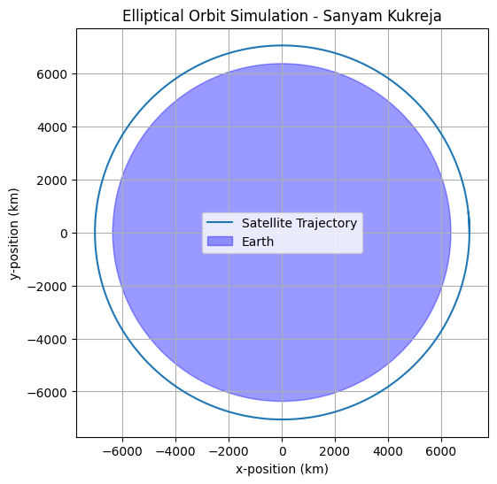

# Satellite Orbit Simulation using RK4

**Author:** Sanyam Kukreja  
**Date:** September 2024  

## Project Overview
This project simulates the 2D orbit of a satellite around Earth using the **Runge–Kutta 4th order (RK4) integration method**. It calculates key orbital parameters, including **semi-major axis, orbital period, and eccentricity**, and visualizes the satellite's trajectory around the Earth.  

The simulation demonstrates skills in:  
- **Python programming**  
- **Numerical methods and simulation**  
- **Orbital mechanics and aerospace concepts**  
- **Data visualization with Matplotlib**  

---

## Features
- Calculates semi-major axis, orbital period, and eccentricity of the orbit  
- Simulates orbital trajectory using Newtonian mechanics  
- Generates a 2D plot of the satellite orbit with Earth shown for scale  
- Modular code structure for easy experimentation and extension  

---

## Installation & Dependencies
This project requires **Python 3** and the following packages:  
```bash
pip install numpy matplotlib

---
## Usage
1. Clone the repository:  
```bash
git clone https://github.com/thesanyam21/python-orbit-modeling.git
```

2. Navigate to the project folder:  
```bash
cd python-orbit-modeling
```

3. Run the simulation:  
```bash
python orbit_simulation.py
```

4. Observe the **orbital parameters printed in the terminal** and the **trajectory plot** displayed:



## Notes
- The simulation currently models a **circular/elliptical 2D orbit**.  
- Future improvements could include:  
  - 3D orbital visualization  
  - Atmospheric drag and perturbations  
  - Incorporation of space weather effects  

## License
This project is for educational and portfolio purposes.
